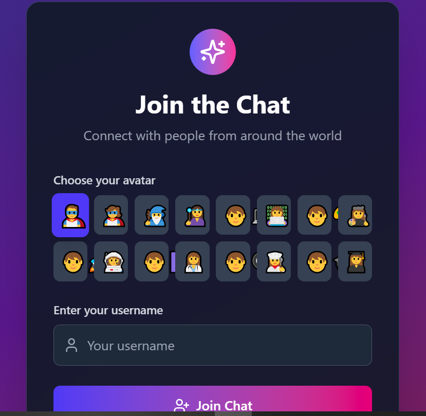

# 💬 Real-Time Chat Application

A modern, real-time chat application built with React, Node.js, Socket.io, and MongoDB. This application demonstrates bidirectional communication with features like live messaging, user presence, typing indicators, and real-time notifications.


## 📸 Screenshots

### Main Chat Interface


*The main chat interface showing real-time messaging, room selection, and user list*

## 🚀 Features

### Core Chat Functionality
- **Real-time messaging** with instant message delivery
- **Multiple chat rooms** (General, Random, Help)
- **User authentication** with username and avatar selection
- **Online/offline status** tracking
- **Message timestamps** and sender information

### Advanced Features
- **Typing indicators** showing when users are composing messages
- **Message reactions** (heart, thumbs up, laugh, sad, angry, surprise)
- **Private messaging** between users
- **Real-time notifications** for new messages
- **Browser notifications** when the app is in background
- **Message search** functionality
- **Responsive design** for desktop and mobile

### User Experience
- **Modern UI** with dark theme and gradient accents
- **Smooth animations** and transitions
- **Auto-scroll** to latest messages
- **Reconnection handling** for network issues
- **Emoji picker** for enhanced messaging

## 🛠️ Tech Stack

### Frontend
- **React 19.1.0** - Modern React with hooks
- **Vite** - Fast build tool and dev server
- **Tailwind CSS** - Utility-first CSS framework
- **Socket.io Client** - Real-time communication
- **Lucide React** - Beautiful icons
- **React Toastify** - Toast notifications

### Backend
- **Node.js** - JavaScript runtime
- **Express.js** - Web framework
- **Socket.io** - Real-time bidirectional communication
- **MongoDB** - NoSQL database
- **Mongoose** - MongoDB object modeling
- **CORS** - Cross-origin resource sharing

## 📦 Installation

### Prerequisites
- Node.js (v18+ recommended)
- MongoDB installed and running locally
- pnpm (recommended) or npm

### Setup Instructions

1. **Clone the repository**
   ```bash
   git clone <repository-url>
   cd week-5-web-sockets-assignment-Jakababa94
   ```

2. **Install server dependencies**
   ```bash
   cd server
   pnpm install
   ```

3. **Install client dependencies**
   ```bash
   cd ../client
   pnpm install
   ```

4. **Set up environment variables**
   
   Create a `.env` file in the server directory:
   ```env
   PORT=5000
   MONGODB_URI=mongodb://localhost:27017/chat-app
   CLIENT_URL=http://localhost:5173
   ```

5. **Start the development servers**

   **Terminal 1 - Start the server:**
   ```bash
   cd server
   pnpm run dev
   ```

   **Terminal 2 - Start the client:**
   ```bash
   cd client
   pnpm run dev
   ```

6. **Open your browser**
   - Frontend: http://localhost:5173
   - Backend API: http://localhost:5000

## 🏗️ Project Structure

```
week-5-web-sockets-assignment-Jakababa94/
├── client/                          # React frontend
│   ├── src/
│   │   ├── components/             # React components
│   │   │   ├── ChatRoom.jsx        # Main chat interface
│   │   │   ├── MessageBubble.jsx   # Individual message component
│   │   │   ├── RoomList.jsx        # Room selection sidebar
│   │   │   ├── UserList.jsx        # Online users list
│   │   │   ├── EmojiPicker.jsx     # Emoji selection
│   │   │   └── NotificationManager.jsx # Notification system
│   │   ├── hooks/
│   │   │   └── useSocket.js        # Socket.io custom hook
│   │   ├── pages/
│   │   │   └── LoginForm.jsx       # User authentication
│   │   └── services/
│   │       └── backendInt.js       # API integration
│   └── package.json
├── server/                          # Node.js backend
│   ├── config/
│   │   └── db.js                   # MongoDB connection
│   ├── controllers/                 # Route controllers
│   │   ├── authController.js
│   │   ├── messageController.js
│   │   └── roomController.js
│   ├── models/                      # Mongoose models
│   │   ├── Message.js
│   │   ├── Room.js
│   │   └── User.js
│   ├── routes/                      # Express routes
│   │   ├── authRoutes.js
│   │   ├── messageRoutes.js
│   │   └── roomRoutes.js
│   ├── socket/                      # Socket.io handlers
│   │   └── index.js
│   ├── server.js                    # Main server file
│   └── package.json
└── README.md
```

## 🔧 API Endpoints

### Authentication
- `POST /api/auth/register` - Register a new user

### Rooms
- `GET /api/rooms` - Get all rooms
- `POST /api/rooms` - Create a new room

### Messages
- `GET /api/messages/:roomId` - Get messages for a room

## 🔌 Socket Events

### Client to Server
- `join` - User joins the chat
- `join_room` - User joins a specific room
- `send_message` - Send a message to a room
- `send_private_message` - Send a private message
- `typing` - User typing indicator
- `add_reaction` - Add reaction to a message

### Server to Client
- `users_list` - Updated list of online users
- `rooms_list` - Updated list of rooms
- `room_messages` - Messages for a specific room
- `new_message` - New message received
- `private_message` - Private message received
- `user_typing` - User typing indicator
- `reaction_updated` - Message reaction updated

## 🎨 Features in Detail

### Real-time Messaging
- Instant message delivery across all connected clients
- Message persistence in MongoDB
- Support for text, image, and file messages
- Message reactions with emoji support

### User Management
- Simple username-based authentication
- Avatar selection from predefined options
- Online/offline status tracking
- Last seen timestamps

### Room System
- Multiple predefined rooms (General, Random, Help)
- Room-specific message history
- User presence tracking per room
- Room-specific typing indicators

### Notifications
- Real-time browser notifications
- In-app notification system
- Sound notifications for new messages
- Unread message indicators

## 🚀 Deployment

### Backend Deployment (Render/Heroku)
1. Create a new web service
2. Connect your GitHub repository
3. Set environment variables:
   - `MONGODB_URI` - Your MongoDB connection string
   - `CLIENT_URL` - Your frontend URL
4. Deploy the server directory

### Frontend Deployment (Vercel/Netlify)
1. Connect your GitHub repository
2. Set build settings:
   - Build command: `npm run build`
   - Output directory: `dist`
3. Set environment variables:
   - `VITE_SERVER_URL` - Your backend URL
4. Deploy

## 🧪 Testing

### Manual Testing
1. Open multiple browser windows/tabs
2. Join the chat with different usernames
3. Test real-time messaging
4. Test room switching
5. Test typing indicators
6. Test message reactions
7. Test private messaging
8. Test notifications

### Database Testing
```bash
# Connect to MongoDB
mongosh

# Switch to your database
use chat-app

# View collections
show collections

# View users
db.users.find()

# View messages
db.messages.find()

# View rooms
db.rooms.find()
```

## 🔧 Configuration

### Environment Variables

**Server (.env)**
```env
PORT=5000
MONGODB_URI=mongodb://localhost:27017/chat-app
CLIENT_URL=http://localhost:5173
NODE_ENV=development
```

**Client (.env)**
```env
VITE_SERVER_URL=http://localhost:5000
```

## 🐛 Troubleshooting

### Common Issues

1. **Socket connection failed**
   - Check if server is running on port 5000
   - Verify CORS configuration
   - Check network connectivity

2. **MongoDB connection error**
   - Ensure MongoDB is running locally
   - Check connection string in .env file
   - Verify database permissions

3. **Messages not appearing**
   - Check browser console for errors
   - Verify socket event handlers
   - Check database connection

4. **Notifications not working**
   - Ensure browser notifications are enabled
   - Check if app is in focus/background
   - Verify notification permissions

## 🤝 Contributing

1. Fork the repository
2. Create a feature branch (`git checkout -b feature/amazing-feature`)
3. Commit your changes (`git commit -m 'Add amazing feature'`)
4. Push to the branch (`git push origin feature/amazing-feature`)
5. Open a Pull Request

## 📝 License

This project is licensed under the ISC License.

## 👨‍💻 Author

**Jakababa94**
- GitHub: [@Jakababa94](https://github.com/Jakababa94)

## 🙏 Acknowledgments

- Socket.io documentation and examples
- React documentation and community
- Tailwind CSS for the beautiful UI components
- Lucide React for the amazing icons

---

**Built with ❤️ using React, Node.js, Socket.io, and MongoDB**
